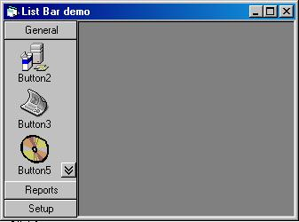

## Simple Outlook Style List Bar

### Description

A simple (and free) way to create an Outlook-style listbar on a form. This could easily be made into an ocx but for simplicity I have just designed it as part of the program.
 
### More Info
 

             |
---                |---
**Submitted On**   |2002-04-26 10:44:22
**By**             |[Brent Podruzny](https://github.com/Planet-Source-Code/PSCIndex/blob/master/ByAuthor/brent-podruzny.md)
**Level**          |Beginner
**User Rating**    |5.0 (50 globes from 10 users)
**Compatibility**  |VB 6\.0
**Category**       |[Custom Controls/ Forms/  Menus](https://github.com/Planet-Source-Code/PSCIndex/blob/master/ByCategory/custom-controls-forms-menus__1-4.md)
**World**          |[Visual Basic](https://github.com/Planet-Source-Code/PSCIndex/blob/master/ByWorld/visual-basic.md)
**Archive File**   |[Simple\_Lis761524262002\.zip](https://github.com/Planet-Source-Code/brent-podruzny-simple-outlook-style-list-bar__1-34136/archive/master.zip)

